# 积木目录（Block Catalog）

规格驱动章节（`spec.json` + `SpecChapter`）一共有 **19 种积木**。这份文档逐个说明：它是什么、长什么样、适合讲什么、不适合讲什么、怎么写、渲染器替你保证了什么、机器会查什么。

- **字段的权威定义**在 [`templates/src/components/scene/spec-types.ts`](../templates/src/components/scene/spec-types.ts)，**校验规则**在 [`templates/scripts/spec-check.mjs`](../templates/scripts/spec-check.mjs)。这份文档和它们冲突时以代码为准。
- **写 spec 的规则书**是 [`SPEC-AUTHORING.md`](SPEC-AUTHORING.md)（也是流水线喂给模型的 system prompt）。这份目录比规则书详细，给人查，不喂给模型。
- **手写章节**（不走 spec）用同名 React 组件：`import { BarChart, Grid, … } from "../../components/scene"`，props 和 spec 字段基本一致，区别见各节「手写章节」一行。
- **例图**全部是真实渲染：一章 27 步的样张 spec，`tufte-ink` 主题，playwright 在 1440×810 视口里截 `.stage-fitter`。会动的积木另有一张**动画进行中**的帧（文件名带 `-mid`）。重新生成的方法见文末 [§ 例图怎么重新生成](#例图怎么重新生成)。
- 样张里的数字只为演示写法，**不是任何论文的结论**。

---

## 目录

- [总览](#总览)
- [积木和页面的关系](#积木和页面的关系)
- [所有积木共用的规则](#所有积木共用的规则)
- [按内容选积木](#按内容选积木)
- 文字类：[Prose](#1-prose) · [Quote](#2-quote) · [Callout](#3-callout)
- 数字类：[BigNumber](#4-bignumber) · [Stats](#5-stats) · [BarChart](#6-barchart)
- 列表与对照类：[RevealList](#7-reveallist) · [Chips](#8-chips) · [Compare](#9-compare) · [DataTable](#10-datatable)
- 结构与流程类：[Pipeline](#11-pipeline) · [Diagram](#12-diagram)
- 讲解类：[Formula](#13-formula) · [CodeBlock](#14-codeblock) · [Figure](#15-figure)
- 动画类：[Grid](#16-grid) · [Flow](#17-flow) · [Gauge](#18-gauge)
- 兜底：[Placeholder](#19-placeholder)
- [常见组合](#常见组合) · [已知限制](#已知限制) · [例图怎么重新生成](#例图怎么重新生成)

---

## 总览

| # | 积木 | 类别 | 一句话 | 跨步推进靠什么 | 宽积木¹ | 必填字段 |
|---|---|---|---|---|---|---|
| 1 | `Prose` | 文字 | 一到三句正文，三档字号 | — | | `text` |
| 2 | `Quote` | 文字 | 论文原话 + 出处 | — | | `text` |
| 3 | `Callout` | 文字 | 要点卡：小标签 + 标题 + 正文 | — | | — |
| 4 | `BigNumber` | 数字 | 一个大数字，可从 0 跳到目标值 | 换 `value` | | `value` |
| 5 | `Stats` | 数字 | 一排 2~4 个数字并列 | 逐项焦点 | ≥4 项 | `items` |
| 6 | `BarChart` | 数字 | 零基线柱图，高亮 / 差值 / 参考线 | 换 `items`（纵轴自动锁定） | 横向或 ≥5 根 | `items` |
| 7 | `RevealList` | 列表 | 列表逐项揭示 | `shown` +1 | | `items` `shown` |
| 8 | `Chips` | 列表 | 一排药丸，逐个点亮 | `active` / `done` | ≥4 项 | `items` |
| 9 | `Compare` | 对照 | 2~3 栏同尺度对照 + 结论 | 逐栏焦点 | | `columns` |
| 10 | `DataTable` | 对照 | 结果表，逐行揭示 + 圈格 | `shownRows` / `marks` | ✓ | `columns` `rows` |
| 11 | `Pipeline` | 流程 | 横向流程条，当前段点亮 | `active` | ✓ | `stages` |
| 12 | `Diagram` | 结构 | 节点连线图 | 节点 / 边的 `state`、`draw` | ✓ | `nodes` |
| 13 | `Formula` | 讲解 | KaTeX 公式，逐符号点亮 | `active` | | `tex` 或 `parts` |
| 14 | `CodeBlock` | 讲解 | 代码逐段讲 + 变量快照 | `active` / `vars` | ✓ | `code` |
| 15 | `Figure` | 讲解 | 论文原图，聚光 / 推镜 / 子图 | `active` 区域 | | `src` `label` `alt` |
| 16 | `Grid` | 动画 | 同一张网格扩大点亮范围（层级） | `lit` / `done` | ✓ | `cols` `lit` |
| 17 | `Flow` | 动画 | 数据包沿轨道一趟趟跑（往返计数） | 加长 `trips` | ✓ | `lanes` |
| 18 | `Gauge` | 动画 | 正方形按比例长 + 有上限的容器（扫参） | 换 `value` / `input.value` | | `value` `capacity` |
| 19 | `Placeholder` | 兜底 | 缺素材时的占位卡 | — | | `label` |

¹ **宽积木**天生要整宽：不和别的积木并排，整宽堆在下面（`SpecChapter.tsx` 的 `wide()`）。

---

## 积木和页面的关系

一句话：**页面是一拍口播的舞台，积木是舞台上的道具**。构图和 `id` 这两个开关，决定每次点击时是换舞台、换道具，还是只让道具动一下。

### 层级

```
演示（presentation）
└─ 章（chapter）            registry 里注册的一项；规格驱动时 = 一份 spec.json
   └─ 步（step）             = 口播的一拍 = 一次点击 = 一整屏 1920×1080（即「页面」）
      ├─ 页面外框（不是积木）   标题 / lead、左下角证据出处、悬浮进度条
      ├─ 构图（composition）   8 选 1，决定积木怎么摆
      └─ 积木（blocks）       1~5 块，各有角色
         ├─ primary       恰好 1 块，视线第一站
         ├─ secondary     协助理解
         ├─ background    铺在底层（layered-depth 用）
         └─ annotation    落在底部一行（出处、单位、小注）
```

最硬的约束是**一步 = 一拍 = 一屏**：spec 里第 i 个 step 对应口播第 i 拍，机器用 `say` 字段逐步核对，防止画面和口播错位。所以「页面」不是自由排版的网页，而是跟着口播节奏一屏一屏推进的画面。

### 分工

| | 页面（step + 构图） | 积木 |
|---|---|---|
| 决定 | 这一拍放哪几样东西、谁是主角、怎么排 | 每样东西长什么样、怎么动 |
| 内容 | 标题（一句结论）、证据类型和出处 | 数字、图、表、公式、代码…… |
| 排版 | 构图决定并排还是堆叠、主次份额（60/40、1/1、2/1、三等分） | 自己内部的结构（柱图的零基线、表格对齐……） |
| 尺寸 | 内容超出可用高度时整体等比缩小；同屏块数越多，图表越矮（1 块约 600px、2 块 460px、≥3 块 300px）；标题和正文开启 `text-wrap`（balance / pretty），不留一两个字的孤行 | 在分到的格子里自适应 |
| 外框 | 标题、左下角出处、进度条、片尾都属于页面层 | 只管格子里的东西 |

### 渲染时一步怎么拼出来（`SpecChapter.tsx`）

1. 按 `composition` 查排布方式（row / stack，primary 和 secondary 的份额）。
2. 把积木分成三组：主内容、`background`（铺底层）、`annotation`（底部一行）。
3. **宽积木**（Pipeline、DataTable、Diagram、CodeBlock、Grid、Flow，以及横向或 ≥5 根的 BarChart、≥4 项的 Chips、≥4 项的 Stats）不和别人并排，整宽堆在下面。
4. 其余主内容最多 2 块并排（triptych 最多 3 块），多出来的整宽堆在下面。两块并排时 primary 至少占 52% 宽；三块并排时三栏等分（以前也给 primary 保底 52%，另外两栏只剩约 24%，标题被拆成竖列）。
5. 每块套一个错误边界：某块数据坏了只显示「积木渲染失败」的占位卡，不会让整屏白掉。
6. 垂直方向：内容区填满标题下方的主体，空白**按上 3 下 2 分**（内容略往下沉，整屏重心不偏上）；`annotation` 角色的积木固定在**底部一行**。
7. 标题、证据出处由页面层画；积木只渲染在自己的格子里。

### 跨步：页面和积木怎么一起变

**构图决定页面换不换，`id` 决定积木换不换。**

| 相邻两步 | 观众看到的 | 用在 |
|---|---|---|
| 构图不同 | 整屏重挂，所有积木重新入场 —— 「换了一页」 | 换话题、换角度 |
| 构图相同，积木 id 相同 | 这块积木保留不动，只更新内容 —— 「同一页上东西在推进」 | 逐项揭示、逐符号点亮、网格扩圈、镜头在原图上滑动 |
| 构图相同，积木 id 不同（或没写 id） | 页面骨架保留，这块作为新内容入场 | 主视觉不变、旁边的解释卡换一张 |

想做连续的讲解序列（公式讲 6 步、代码讲 4 步、Grid 扩 3 级），就要连着几步**保持同一个构图和同一个 id**。渲染器会自动给这类序列标 `stable`，防止它被「同构图最多连续 2 步」的规则拆掉；反过来，不是这种序列却连用同一构图超过 2 步，会被自动换掉，免得页面一成不变。

### 一步之内：焦点在积木之间移动

页面还管步内焦点：口播讲到哪，高亮移到哪。`focus` 让高亮按时间依次扫过几块积木（整块点亮），或扫过某块积木里的几项（Chips 的药丸、Compare 的栏、DataTable 的行、Stats 的数字……）。不写也会自动扫：有 2 块以上主内容就按块扫，只有一块多项积木就按项扫。

### 一个具体例子

样张里 Gauge 的两步：

- **页面层**：两步都是 `asymmetric-60-40`，标题分别是「Gauge · 扫参到上限」「Gauge · 超出上限」，证据类型标在左下角。
- **积木层**：左边 60% 是 primary 的 `Gauge`，右边 40% 是 secondary 的 `Callout`（算一下）。
- **跨步**：构图相同、Gauge 的 id 相同（`attn`），所以正方形和容器是从 5.1 GB **平滑长到** 144 GB 的；Callout 没写 id，每步作为新卡片重新入场。

| 第一步 | 第二步（同构图 + 同 id） |
|---|---|
| 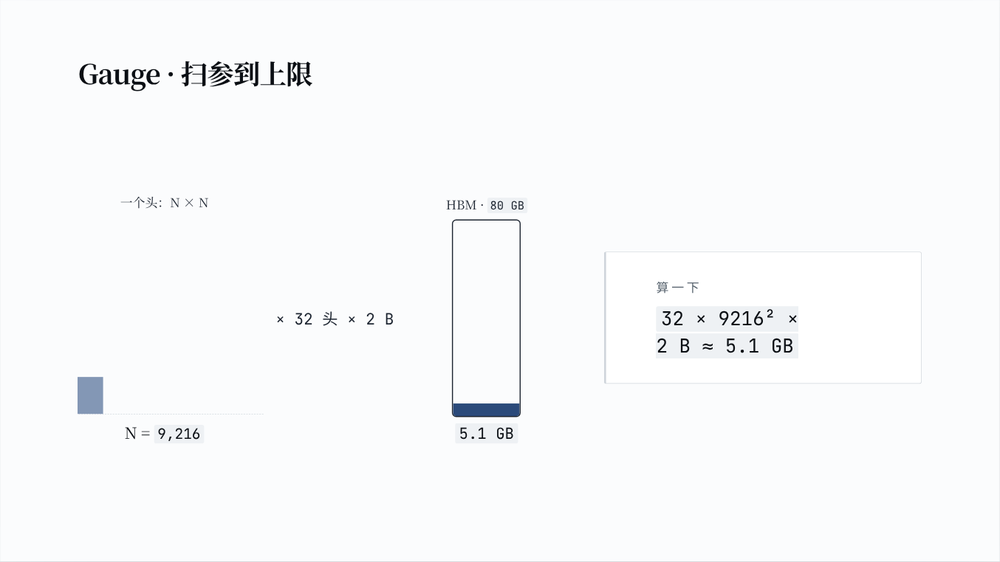 | 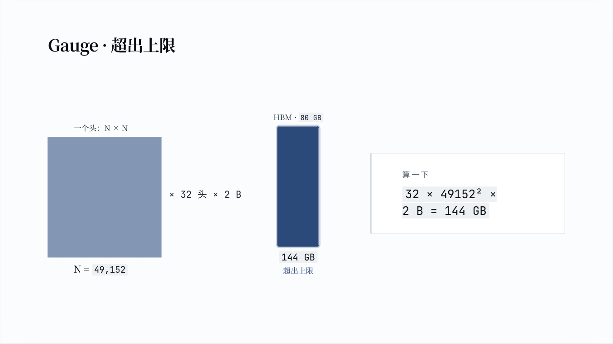 |

具体字段规则见下一节「所有积木共用的规则」。

---

## 所有积木共用的规则

### 公共字段

| 字段 | 说明 |
|---|---|
| `type` | 必填，19 选 1，拼错直接判失败 |
| `role` | `primary` / `secondary` / `background` / `annotation`。**每步恰好一个 primary**（视线第一站）；`background` 铺在底层（`layered-depth` 用）；`annotation` 落在底部一行（出处、单位、小注） |
| `id` | **相邻步同 id = 同一块**：保留 DOM，不重播入场，只更新内容。所有「跨步推进」（逐项揭示、逐符号点亮、网格扩圈、镜头滑动）都靠它 |
| `delay` | 入场延迟 ms。primary ≤150（smoke 只等 220ms 采样）；secondary 常用 120~300 |
| `span` | 并排时的份额（flex-grow）。和 `Diagram` / `BarChart` / `Placeholder` 自己的像素 `width` `height` 不是一回事 |
| `intent` | ≤60 字，「作者用这张图 / 表想证明什么」，渲染成块下方的「作者想说明」一行。论文的表、柱图、原图都应该写 |

### 一步之内

- 每步 1~5 块积木，恰好一个 primary；只放这一拍最值得放大的 1~3 样东西。
- 文字上限：**单个字符串 ≤120 字，一步上屏合计 ≤260 字**；上屏文字和口播逐字重合超过 40% 判「念字」。画面不是字幕。
- 所有字符串支持轻标记：`**强调**`（accent 色）、`` `等宽` ``（mono 字体，数字和代码用它）、`\n` 换行。
- 同屏积木越多，图表越矮：Diagram / BarChart / Figure 的高度上限按同屏块数收缩（1 块 600~680px，2 块 460px，≥3 块 300px）。内容超出可用高度时整体等比缩小，不会被裁。

### 跨步

- 相邻步同构图 + 同 id 的讲解序列（Formula / CodeBlock / Figure / DataTable / Grid / Flow / Gauge）会被自动标 `stable`，保证是「推进」不是「重挂」。
- 构图一变，整屏重挂，所有积木重新入场 —— 想让高亮「滑过去」就别换构图。
- 同 id 的 `BarChart` 跨步数值在变时，纵轴上限自动锁成整段序列的最大值（否则柱高不能跨步比）；同 id 的 `Gauge` 序列统一 `input.max` 和 `capacity`。

### 步内焦点（`focus`）

步级字段 `focus` 让高亮在本步时长内依次移动：`["左块id", "右块id"]` 整块依次点亮；`[{ "id": "x", "items": [0,1,2] }]` 逐项点亮。支持逐项的积木：`Chips` `RevealList` `Pipeline` `Compare`（栏）`Stats`（数字）`DataTable`（行）。不写时自动：≥2 块主内容按顺序扫，单块多项按项扫。

---

## 按内容选积木

| 这一拍要讲的是 | 首选 | 备选 |
|---|---|---|
| 一句结论 / 金句 | `Prose`（display） | `Quote`（论文原话时） |
| 一个关键数字 | `BigNumber` | `Stats`（2~4 个并列） |
| 几组数比大小 | `BarChart` | `DataTable`（要看多列时） |
| 论文的结果表 | `DataTable`（marks + intent） | `Figure`（原表截图） |
| 两三种做法对照 | `Compare` | 两块 `Callout`（split-screen） |
| 一串有顺序的东西（token、模块、时间线） | `Chips` | `Pipeline` |
| 流程走到哪一步 | `Pipeline` | `Chips`（arrows） |
| 架构、数据流、回环 | `Diagram` | `Figure`（论文自己的架构图） |
| 要点清单，一项一拍 | `RevealList` | `Callout` 多段 |
| 关键公式 | `Formula`（逐符号） | `Prose` + `等宽`（没装 KaTeX 时） |
| 算法 / 代码 | `CodeBlock`（notes + vars） | — |
| 论文原图的某一块 | `Figure`（regions + active） | — |
| 小单元组成大单元（层级） | `Grid` | `Chips`（层级是有名字的模块时） |
| 「跑 N 次 vs 跑 M 次」、访存 / 往返 / 重算次数 | `Flow` | `Compare` |
| 一个输入变大，另一个量非线性涨、有上限 | `Gauge` | `BarChart`（没有上限时） |
| 素材拿不到 | `Placeholder` | — |

> 实测提醒（2026-10-05，2605.18818v1 第 2 版）：模型 93 步里一次都没选 Grid / Flow / Gauge，「OCR 跑 8 次 vs LLM 跑 1 次」「5 pod × 5 任务 = 25 个并发槽」都被画成了 Compare / BarChart。识别这类场景要看口播里的**说法**，不是看抽象分类。见 [已知限制](#已知限制)。

---

# 文字类

## 1. Prose

**一句话**：一到三句正文，按重要程度选三档字号。

**描述**：最基础的文字积木。`body` 是普通说明；`large` 是论文步的主文字；`display` 是整屏只放一句的结论句。它是画面的「旁白补充」，不是口播的字幕。

**特点**
- 三档字号：`body` 24px、`large` 40px（规格章 46px）、`display` 用主题的 h2 字号，标题字体。
- `text` 可以是数组，每项一段；`stagger: true` 时段落依次入场。
- `align` 可选 `left` / `center`。

**适合**
- 结论句、反直觉的一句话、「一句话讲它的核心主张」。
- 给主视觉配一行短注（作为 secondary 或 annotation）。

**不适合**
- 大段解释 —— 那是口播的活；上屏超过两三行就是 PPT。
- 有结构的内容（并列要点用 `RevealList`，对照用 `Compare`，数字用 `BigNumber`）。
- 论文原话（用 `Quote`，带出处）。

**例子**
```json
{ "type": "Prose", "role": "primary", "size": "display", "text": "瓶颈在**识字**，不在理解" }
```

**UI/UE 表达要素**

| 要素 | 说明 |
|---|---|
| 视觉结构 | 一到三段文字，无边框无底色 |
| 层级 | 字号三档；`**强调**` 用 accent 色点出关键词 |
| 状态 | 无 |
| 动效 | 整块上浮淡入；`stagger` 时逐段 |
| 跨步推进 | 无（换文字就是换内容） |
| 尺寸 | 最大行宽 body 1100px / large 1400px / display 1500px |
| 颜色 | 正文色；强调词 accent |

**例图**


**校验**：`size` 只能 body / large / display；单段 ≤120 字。

**常见错误**：把口播原句贴上屏（念字闸会抓）；一屏堆三段 body 当正文。

---

## 2. Quote

**一句话**：论文原话或金句，下面一行出处。

**描述**：让观众知道「这是作者自己说的」。原话保持原文（英文就英文），出处写到小节。

**特点**
- 大号衬线字体居中，出处用小号等宽字。
- 只有 `text` 和 `by` 两个字段。

**适合**
- 作者的核心主张、自我定位（「这是 case study 不是 benchmark」）。
- 讲者要和作者观点区分开的时候（证据层 `fact`）。

**不适合**
- 讲者自己的话（用 `Prose` / `Callout`，证据层 `infer`）。
- 很长的段落 —— 截取最关键的一句。

**例子**
```json
{ "type": "Quote", "role": "primary", "text": "Operating this architecture in production revealed several practical lessons.", "by": "§7 · Lessons Learned" }
```

**UI/UE 表达要素**

| 要素 | 说明 |
|---|---|
| 视觉结构 | 引文 + 出处两行，居中 |
| 层级 | 引文大字，出处小号 mono |
| 状态 / 跨步 | 无 |
| 动效 | 淡入上浮 |
| 证据层 | 通常配 `evidence.type: "fact"` + locator |

**例图**

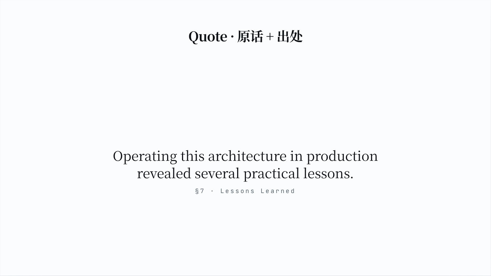

**常见错误**：出处写「论文」而不写小节；把翻译后的意译当原话。

---

## 3. Callout

**一句话**：要点卡 —— 小标签 + 标题 + 正文。

**描述**：最通用的辅助卡片。小标签（kicker）说明这张卡的角色（结论 / 为什么 / 算一下），标题是要点，正文一两行补充。`tone` 控制强调程度。

**特点**
- `tone`：`base`（普通卡）、`accent`（左侧 accent 竖条，重点）、`muted`（半透明，退后）、`plain`（无边框无底色）。
- `body` 可以是数组，每项一行。
- 卡片内的 kicker 照常显示（步级 kicker 已退役，卡内的没有）。

**适合**
- 给主视觉配解释（asymmetric-60-40 的右栏）。
- 两三张并排做轻量对照（triptych / split-screen）。
- 「算一下」「看哪里」这类引导卡。

**不适合**
- 当主视觉 —— 一整章都是 Callout = 纯文字章，验收不过。
- 一屏五六张卡（AI 味最重的写法）。
- 严格的同尺度对照（用 `Compare`）。

**例子**
```json
{ "type": "Callout", "role": "primary", "tone": "accent", "kicker": "结论", "title": "OCR 才是瓶颈",
  "body": ["一份 8 页文档 OCR 要 14 秒", "LLM 解析只要 3 秒"] }
```

**UI/UE 表达要素**

| 要素 | 说明 |
|---|---|
| 视觉结构 | 卡片：kicker（小号大写 mono）→ 标题 → 正文 |
| 层级 | 标题 > 正文 > kicker |
| 状态 | 四种 tone |
| 动效 | 上浮淡入 |
| 跨步推进 | 无；要逐条出现用 `RevealList` |
| 颜色 | accent 只出现在左竖条，不整卡染色 |

**例图**

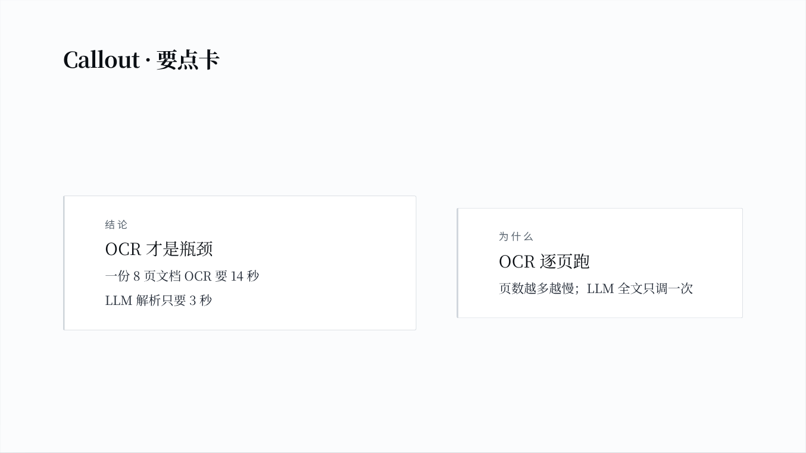

**常见错误**：kicker 写「锚 / 桥 / 术语」这类写稿标签（会被拦）；正文写成一段话。

---

# 数字类

## 4. BigNumber

**一句话**：一个大数字，可以从 0 跳到目标值。

**描述**：让一个数字成为整屏焦点。验算拍的核心积木 —— 数字「真的变」比静态写出来更有说服力。

**特点**
- 三档尺寸：`h1` 88px、`d2` 128px（默认）、`d1` 200px（全屏英雄）。
- `countUp`：整数部分从 0 跳到目标值（CSS 计数，小数部分直接显示）。规格章里 `|value| ≥ 10` 默认开，`countUp: false` 关掉。
- `unit` 小号跟在数字后；`label` 说明这是什么；`sub` 写来源或算式。
- `accent: true` 数字用 accent 色。
- `value` 也可以是字符串（「<0.1%」），这时不跳动。

**适合**
- 头条数字、验算结果、「整整 6 倍」这种一锤定音的数。
- 和一张 Callout 并排：左边数字、右边解释（rule-of-thirds）。

**不适合**
- 几个数要互相比较（用 `Stats` 或 `BarChart`）。
- 带误差、带分布的数据（用 `BarChart` 的 `err`）。
- 数字本身没意义、要靠上下文才懂的时候。

**例子**
```json
{ "type": "BigNumber", "role": "primary", "value": 7140, "unit": "份/小时", "label": "理论上限",
  "sub": "25 个并发槽 × 每份 12.6 秒", "size": "d2", "countUp": true }
```

**UI/UE 表达要素**

| 要素 | 说明 |
|---|---|
| 视觉结构 | 大数字 + 单位 / label / sub 三行 |
| 层级 | 数字远大于其余文字；主题可设斜体 tabular 的英雄数字 |
| 状态 | `accent` |
| 动效 | 数字从 0 跳到目标（`--dur-cinematic`） |
| 跨步推进 | 同 id 换 `value` 时直接变（不重新从 0 数） |
| 数字排版 | tabular-nums，`sub` 里的算式建议用 `` `等宽` `` |

**例图**

| 动画进行中（跳到 317） | 定格 |
|---|---|
|  |  |

**常见错误**：编一个论文里没有的数；`sub` 不写来源；同一章每步都是 BigNumber。

---

## 5. Stats

**一句话**：一排 2~4 个数字并列。

**描述**：多个 BigNumber 等宽排成一行，适合把几项指标放在一起看。每项的字段和 BigNumber 一样，默认 `h1` 尺寸。

**特点**
- 每项：`value` `unit` `label` `sub` `accent` `countUp` `size`。
- 依次入场（stagger）；支持步内逐项焦点。
- **≥4 项时按宽积木整宽排**：4 个数字挤在 60% 的格子里，每个数字下的标签只剩窄窄一列。

**适合**
- 「96% 本地放行 / 4% 转给 VLM / 阈值 0.7」这种一组相关数字。
- 同一个对象的几个维度（准确率、成本、延迟）。

**不适合**
- 要比大小的数（数字并排看不出谁大多少，用 `BarChart`）。
- 超过 4 个数（拆步或用 `DataTable`）。

**例子**
```json
{ "type": "Stats", "role": "primary", "items": [
  { "value": 96, "unit": "%", "label": "本地 CLIP-KNN 直接放行" },
  { "value": 4, "unit": "%", "label": "拿不准，转给 VLM", "accent": true },
  { "value": 0.7, "label": "置信度阈值" } ] }
```

**UI/UE 表达要素**

| 要素 | 说明 |
|---|---|
| 视觉结构 | 等宽列，每列一个数字 + label |
| 状态 | 单项 `accent` 指出重点 |
| 动效 | 逐列上浮；≥10 的数从 0 跳 |
| 跨步推进 | 步内逐项焦点（`focus: [{id, items}]`） |

**例图**

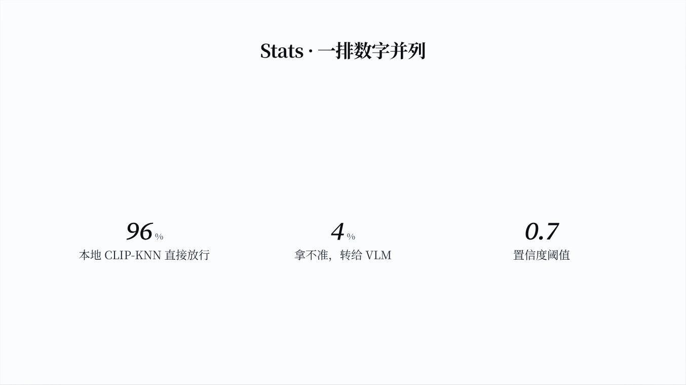

**校验**：每项都要有 `value`。

---

## 6. BarChart

**一句话**：零基线柱图 —— 高亮一根、柱顶标差值、可加参考线和误差线。

**描述**：重画论文数据最常用的积木。渲染器保证了手写柱图最容易出错的几件事：基线永远在 0、标签在独立的行里不会把柱子顶离零线、数字 tabular、柱子从 0 长起。

**特点**
- 每根柱：`label` `value`（数字）`sub` `accent`（高亮）`dim`（弱化）`delta`（柱顶差值，如 `"+22.5"`）`err: [lo, hi]`（误差线）。
- 整体：`unit` `title` `decimals` `max`（纵轴上限）`reference: { value, label }`（参考线）`orientation: "horizontal"` `height`。
- 不写 `max` 时纵轴上限 = 最大值 × 1.12（留出柱顶标签的空间）。
- 同 id 跨步数值在变时，`normalizeSpec` 自动把整段的 `max` 锁成一致。

**适合**
- 方法 vs 基线、消融结果、几组耗时 / 成本对比。
- 横向：项目名长、条目多（≥5 根时自动按宽积木整宽排）。

**不适合**
- 定性材料（热图、样例输出）—— 只能用 `Figure` 原图，自己重画等于伪造。
- 超过 8 根柱（拆步或用 `DataTable`）。
- 有容量上限的「越来越满」（用 `Gauge`）。
- 不同单位的数放一张图。

**例子**
```json
{ "type": "BarChart", "id": "acc", "role": "primary", "title": "执行准确率 %", "unit": "%",
  "items": [ { "label": "单次生成", "value": 61.2 }, { "label": "加检索", "value": 70.4 },
             { "label": "本文方法", "value": 83.7, "accent": true, "delta": "+22.5" } ],
  "reference": { "value": 75, "label": "人工基线" }, "intent": "多轮 + 工具，涨得最多" }
```

**UI/UE 表达要素**

| 要素 | 说明 |
|---|---|
| 视觉结构 | 标题行 → 绘图区（零基线）→ 标签行；数值在柱顶 |
| 层级 | `accent` 柱用 accent 色，其余中性色；`dim` 半透明 |
| 状态 | accent / dim / delta / err / reference |
| 动效 | 柱子从 0 长起（逐根 stagger）；delta 稍后弹出 |
| 跨步推进 | 同 id 换数值：纵轴锁定，柱高**直接跳到**新值（不是平滑过渡） |
| 尺寸 | 纵向默认高 520~600px，随同屏块数收缩 |
| 诚实性 | 零基线不可关；单位、基线、方差保留 |

**例图**

| 纵向：高亮 + 差值 + 参考线 + 作者意图 | 横向：耗时拆解 |
|---|---|
| 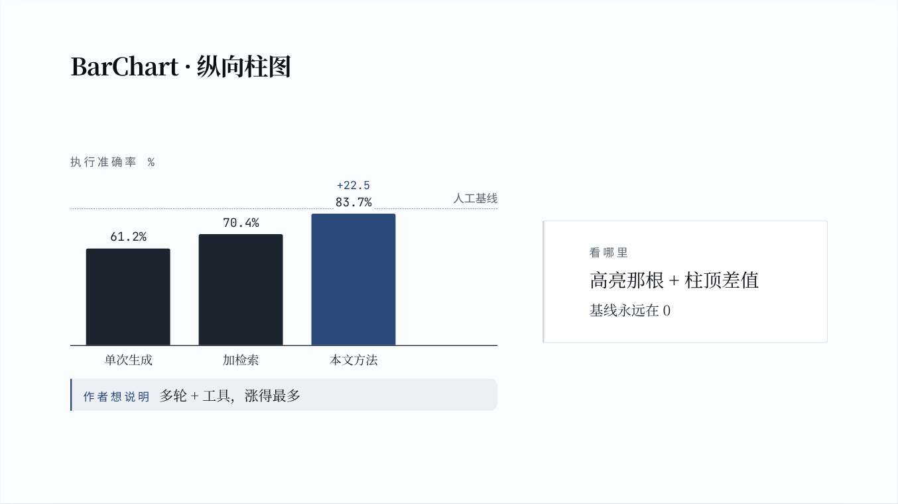 | 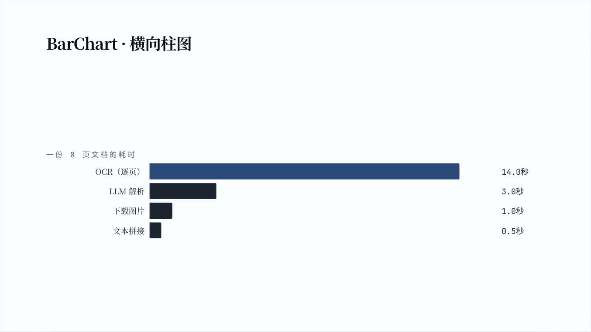 |

**校验**：≤8 根；`value` 必须是数字；`reference` 要写成对象；`max` 是数字。自动修正：`reference` 写成裸数字 → 转对象；`err` 形状不对 → 去掉；同 id 扫参序列 → 锁 `max`。

**常见错误**：只晒最好结果、去掉基线；不同步之间纵轴不一致（已自动修）；把重画的图说成论文原图。

---

# 列表与对照类

## 7. RevealList

**一句话**：列表逐项揭示，一拍出一项。

**描述**：要点清单的标准写法。同一个 id 连续几步，`shown` 每步加一。未出现的项默认占好位置（布局不跳动），当前项左侧有 accent 竖条。

**特点**
- `items`：字符串，或 `{ title, body }`。
- `shown`：已显示几项（1 起）。
- `numbered`（默认编号 01 02 …）、`reserve`（未出现的项占位，默认开；规格章里占位显示成**淡编号 + 分隔线**，让观众看出「后面还有几条」，而不是中间空一大块）、`ghost`（已显示的旧项变灰，规格章默认关 —— 同级信息都保持正常亮度）。

**适合**
- 「五条生产教训」「三个失败姿势」这种平行要点，一拍讲一条。
- 章节收束时的回顾清单。

**不适合**
- 一次全部列出、不逐项讲（那就是 PPT 列表，换 `Compare` 或 `Stats`）。
- 有先后流程关系的步骤（用 `Pipeline` / `Chips`）。
- 每项都很长的段落。

**例子**（同 id 连续两步）
```json
{ "type": "RevealList", "id": "lessons", "role": "primary", "shown": 2,
  "items": [ { "title": "超时按 P99 设", "body": "30 秒太短，同一份文档被跑两遍" },
             { "title": "OCR 是瓶颈", "body": "逐页跑，页数越多越慢" },
             { "title": "准确率不等于稳定", "body": "98% 准，每天仍有 20 份错" },
             { "title": "换模型先看算力画像", "body": "错峰比单看吞吐重要" } ] }
```
下一步同样内容，`"shown": 4`。

**UI/UE 表达要素**

| 要素 | 说明 |
|---|---|
| 视觉结构 | 编号列 + 标题 + 小字说明，行间细分隔线 |
| 状态 | 未出现（淡编号 + 分隔线占位）/ 当前（accent 竖条）/ 已出现 |
| 动效 | 新出现的项上浮淡入 |
| 跨步推进 | 同 id，`shown` +1 |
| 布局稳定 | `reserve` 保证列表总高不变，画面不跳 |

**例图**

| 第一步：shown = 2 | 下一步：shown = 4 |
|---|---|
|  |  |

**校验**：`shown` 必须在 1..items.length（越界自动夹回）。

---

## 8. Chips

**一句话**：一排药丸 —— token 序列、模块清单、时间线，可以逐个点亮。

**描述**：轻量的序列表达。`active` 点亮当前项（可多个），`done` 标出处理过的项（变淡），`arrows` 在相邻项之间画箭头。

**特点**
- `items`：字符串，或 `{ label, sub, state }`（state 直接指定 idle / active / done / dim）。
- `active`：数字或数组；`done`：数组。
- `size`：`md` / `lg`。
- ≥4 项时按宽积木整宽排。

**适合**
- token 序列（`"The" "cat" "sat"`）、分词结果。
- 「分类 → 元数据 → OCR → 拼接 → 解析」这种有名字的步骤，配 `arrows`。
- 层级只有三四级、每级是有名字的模块时，`active` 给数组逐步扩大。

**不适合**
- 每一项需要较多说明（用 `Pipeline`，每段有 sub 行）。
- 大量同质单元（几百个线程、几千个 token 的规模感）—— 用 `Grid`。
- 超过一行能放下的数量。

**例子**
```json
{ "type": "Chips", "role": "primary", "size": "lg", "arrows": true, "active": 2, "done": [0, 1],
  "items": [ "分类", "元数据", { "label": "OCR", "sub": "GPU" }, "拼接", { "label": "解析", "sub": "LLM" } ] }
```

**UI/UE 表达要素**

| 要素 | 说明 |
|---|---|
| 视觉结构 | 圆角药丸横排，可选箭头 |
| 状态 | idle / active（accent 描边 + 淡底 + 外环）/ done（淡化）/ dim |
| 动效 | 依次入场（每项 30ms 错开） |
| 跨步推进 | 同 id 改 `active` = 逐个点亮；步内逐项焦点 |

**例图**

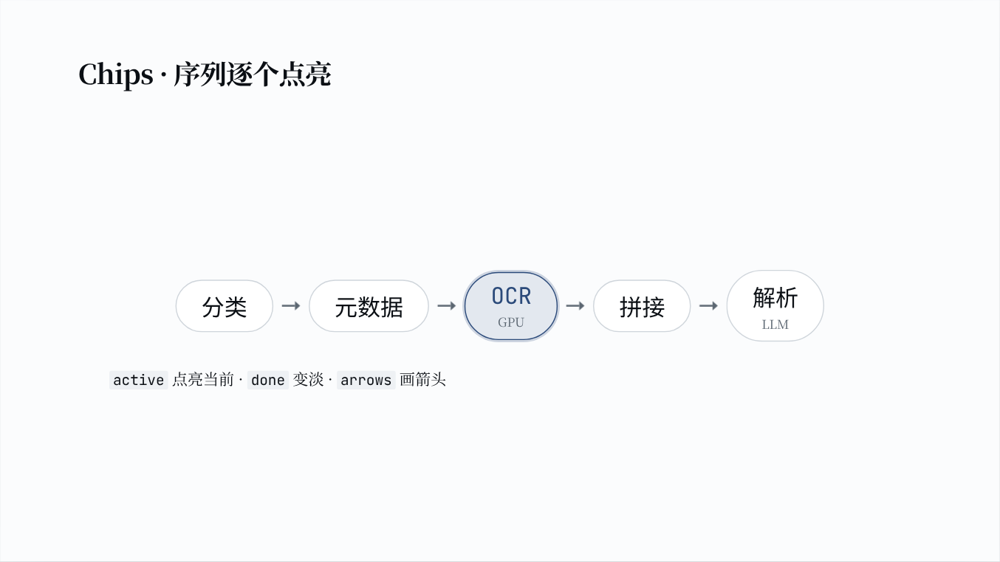

**校验**：每项是字符串或带 `label` 的对象；`done` 单值自动转数组。

---

## 9. Compare

**一句话**：2~3 栏同尺度对照，底部一句结论。

**描述**：基线 vs 新方法、旧 vs 新、错误 vs 正确。各栏同宽、同结构，`tone` 指出哪一栏是重点，`verdict` 用一句话收束。

**特点**
- `columns`：2~3 栏，每栏 `{ title, body, tone }`，`body` 可以是数组（每项一行）。
- `tone`：`base` / `accent`（重点栏）/ `muted`（退后）。
- `verdict`：底部结论，支持 `**强调**`。
- 支持步内逐栏焦点。

**适合**
- 两三种方案的定性对照；类比的「成立在哪 / 崩在哪」。
- 讲「控制变量」：各栏写同样几项、同样顺序，只让被讲的那项不同。

**不适合**
- 定量对比（用 `BarChart`，数字写进文字里看不出差多少）。
- 4 栏以上（拆步或用 `DataTable`）。
- 「搬了几次」这种可数的代价（用 `Flow` 演出来）。

**例子**
```json
{ "type": "Compare", "role": "primary", "verdict": "拆开之后，**瓶颈那层可以单独扩**",
  "columns": [
    { "title": "单体 worker", "tone": "muted", "body": ["分类、OCR、解析挤在一个进程", "OCR 一卡，后面全堵", "扩容只能整个复制"] },
    { "title": "三个微服务", "tone": "accent", "body": ["Gateway / Worker / Inference 各管一摊", "OCR 慢只影响自己", "瓶颈那层单独加 GPU"] } ] }
```

**UI/UE 表达要素**

| 要素 | 说明 |
|---|---|
| 视觉结构 | 等宽栏，每栏标题 + 若干行；底部 verdict |
| 状态 | 栏 tone：base / accent / muted |
| 动效 | 栏依次入场；逐栏焦点 |
| 对照纪律 | 不用颜色区分 A / B（红绿对比是 AI 味），用 tone 的深浅和位置 |

**例图**

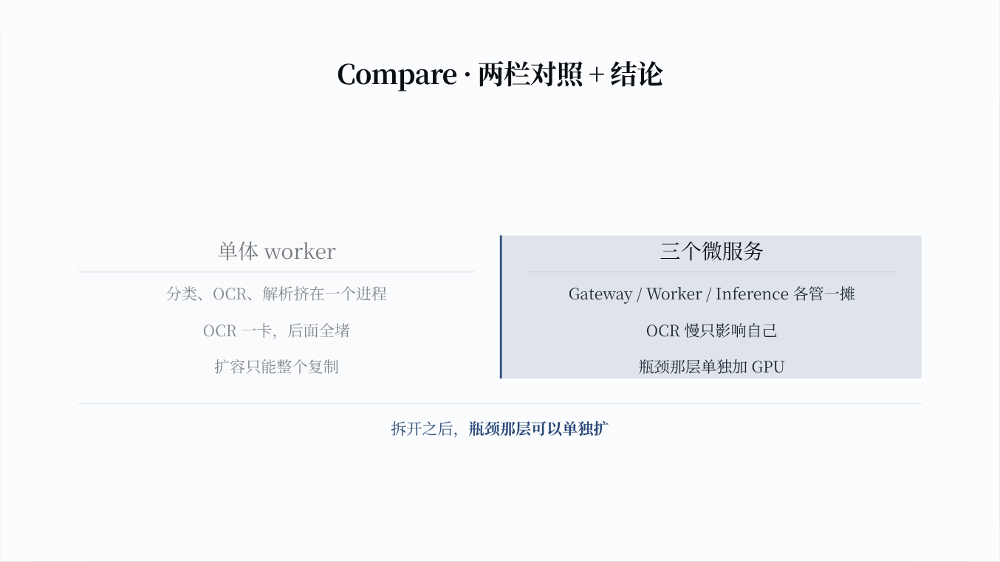

**校验**：只能 2~3 栏。

---

## 10. DataTable

**一句话**：结果表 —— 逐行揭示，圈出作者要你看的格子，下面写作者想证明什么。

**描述**：讲论文表格的标准积木。讲法是「先说看哪里，再说说明什么」：`marks` 圈出要比的几格，`dimOthers` 让其余格退后，`intent` 写这几格证明的那句话。

**特点**
- `columns`：表头字符串；`rows`：每行格数必须等于列数。数字列自动右对齐 + tabular。
- `shownRows`：逐行揭示。
- `marks`：`{row}` 整行 / `{col}` 整列 / `{row, col}` 单格（0 起，行号不含表头），`note` 是格旁小注（如 `"+21.4"`）。
- `highlight`：旧写法的单处高亮。
- `caption`：表下小字（出处）；`intent`：作者意图（DataTable 自己渲染）。
- 宽积木，整宽。

**适合**
- 论文主结果表、消融表（≤8 行）。
- 方法行 + 最强基线 + 差值那一格的对照。

**不适合**
- 大表一次全上（拆步，每步只回答一个问题）。
- 只有两三个数（用 `Stats` / `BarChart`）。
- 想让人感受差多少（表格读数慢，柱图更直观）。

**例子**
```json
{ "type": "DataTable", "role": "primary", "columns": ["方案", "准确率 %", "每页成本 $", "延迟 s"],
  "rows": [ ["VLM-only", 97.1, 0.005, 2.1], ["CLIP-KNN", 92.0, 0.0001, 0.3], ["混合（本文）", 96.8, 0.0003, 0.4] ],
  "marks": [ { "row": 2 }, { "row": 2, "col": 2, "note": "省 94%" } ], "dimOthers": true,
  "intent": "准确率接近 VLM-only，成本接近 CLIP-KNN" }
```

**UI/UE 表达要素**

| 要素 | 说明 |
|---|---|
| 视觉结构 | 表头 → 数据行 → caption → 「作者想说明」条 |
| 状态 | 整行 / 整列淡底；单格 accent 描边 + 小注；其余格 dim |
| 动效 | 逐行揭示；高亮渐变 |
| 跨步推进 | 同 id 改 `shownRows` / `marks` |
| 数字排版 | 数字列右对齐、tabular |

**例图**

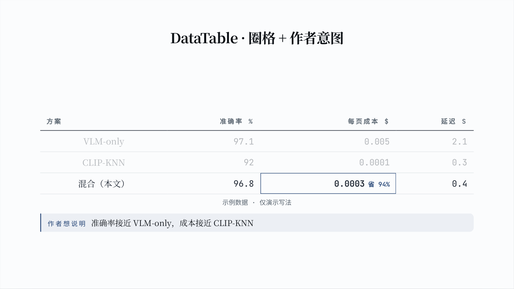

**校验**：表头是字符串；每行格数 = 列数；≤8 行；marks 行列在范围内。自动修正：表头写成 `{key, label}` 对象 → 取 label。

---

# 结构与流程类

## 11. Pipeline

**一句话**：横向流程条 —— 当前段点亮，之前完成，之后弱化。

**描述**：流程走到哪一步。每段有名字和一行 sub（耗时、执行者），段间箭头相连。

**特点**
- `stages`：`[{ label, sub }]`。
- `active`：当前段下标 —— 之前自动 done，之后弱化；或用 `states` 逐段指定 `idle / active / done / todo`。
- 宽积木，整宽；支持步内逐段焦点。

**适合**
- 五步流水线、请求经过的几个服务；同 id 跨步推进 `active`，讲到哪亮到哪。

**不适合**
- 有分支、回环的结构（用 `Diagram`）。
- 段数很多（>6）或每段要大量说明。

**例子**
```json
{ "type": "Pipeline", "role": "primary", "active": 2,
  "stages": [ { "label": "Gateway", "sub": "收单 0.5s" }, { "label": "Worker", "sub": "调度 1s" },
              { "label": "Inference", "sub": "OCR 14s" }, { "label": "解析", "sub": "LLM 3s" } ] }
```

**UI/UE 表达要素**

| 要素 | 说明 |
|---|---|
| 视觉结构 | 圆角段 + 箭头，段内 label / sub 两行 |
| 状态 | done / active（accent 描边）/ todo（弱化） |
| 动效 | 入场后状态渐变 |
| 跨步推进 | 同 id 改 `active` |

**例图**

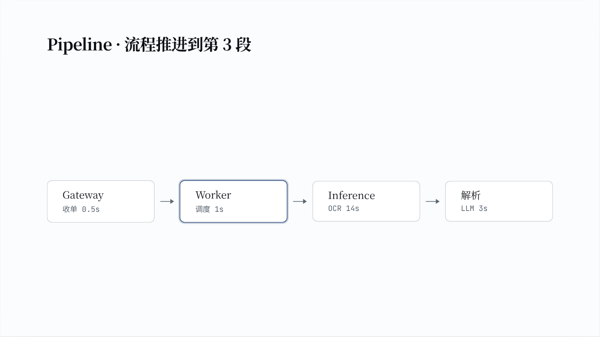

**校验**：`active` 越界自动去掉。

---

## 12. Diagram

**一句话**：节点连线图 —— 架构、数据流、回环。

**描述**：节点是 HTML（吃主题 token、字号 ≥20px），连线画在下层 SVG 里，坐标由组件算。节点和边都有状态，`draw` 让连线自绘入场。

**特点**
- 节点：`{ id, label, sub, x, y, w, h, kind, state }`。`x` `y` 是画布百分比（节点中心），不给就排一行；`kind`：box / pill / circle；`state`：idle / active / done / dim。
- 边：`{ from, to, label, kind, state, dashed, bend }`；`kind`：arrow / line / loop（回环）。
- `draw: true`：本步连线描线入场。
- 规格章画布默认 1500×640。**渲染器会替你排版**：坐标挤在一小块时线性铺开到 10%~90%；节点默认 400×150 起，相撞就逐步收小（下限 120×56），字号跟着收（20~36px）；**≥5 个节点、连线构成树（每个节点至多一个父节点）、至少 3 层时，自动按层重排**，不用你给的坐标。

**适合**
- 架构总览、服务之间怎么调用、带重试回环的流程。
- 同 id 跨步改节点 / 边的 `state`，逐步点亮数据流经过的路径。

**不适合**
- 线性流程（用 `Pipeline`，更清楚）。
- 论文自己有架构图时（用 `Figure` 原图 + regions，别重画）。
- 超过 10 个节点（看不清，拆步或钻取）。
- 想严格控制树状图的横向布局时 —— 会被自动分层覆盖（见下方例图说明）。

**例子**
```json
{ "type": "Diagram", "role": "primary", "draw": true,
  "nodes": [ { "id": "gw", "label": "Gateway", "sub": "收单", "x": 12, "y": 50 },
             { "id": "q", "label": "队列", "x": 37, "y": 50, "kind": "pill" },
             { "id": "wk", "label": "Worker", "sub": "编排", "x": 62, "y": 50, "state": "active" },
             { "id": "inf", "label": "Inference", "sub": "GPU", "x": 88, "y": 25 },
             { "id": "db", "label": "数据库", "x": 88, "y": 78, "state": "dim" } ],
  "edges": [ { "from": "gw", "to": "q", "label": "文档 ID" }, { "from": "q", "to": "wk" },
             { "from": "wk", "to": "inf", "label": "OCR" }, { "from": "wk", "to": "db", "dashed": true },
             { "from": "inf", "to": "db", "label": "写结果" },
             { "from": "wk", "to": "q", "kind": "loop", "label": "超时重投", "dashed": true } ] }
```

**UI/UE 表达要素**

| 要素 | 说明 |
|---|---|
| 视觉结构 | 节点卡（label + sub）+ SVG 连线 + 边标签 |
| 状态 | 节点 idle / active（accent 描边）/ done / dim；边 idle / active / dim、虚线 |
| 动效 | `draw` 时连线描线入场；状态切换渐变 |
| 跨步推进 | 同 id 改 `state` / `draw` |
| 布局 | 坐标自动铺开、节点自动收缩、树图自动分层 |

**例图**

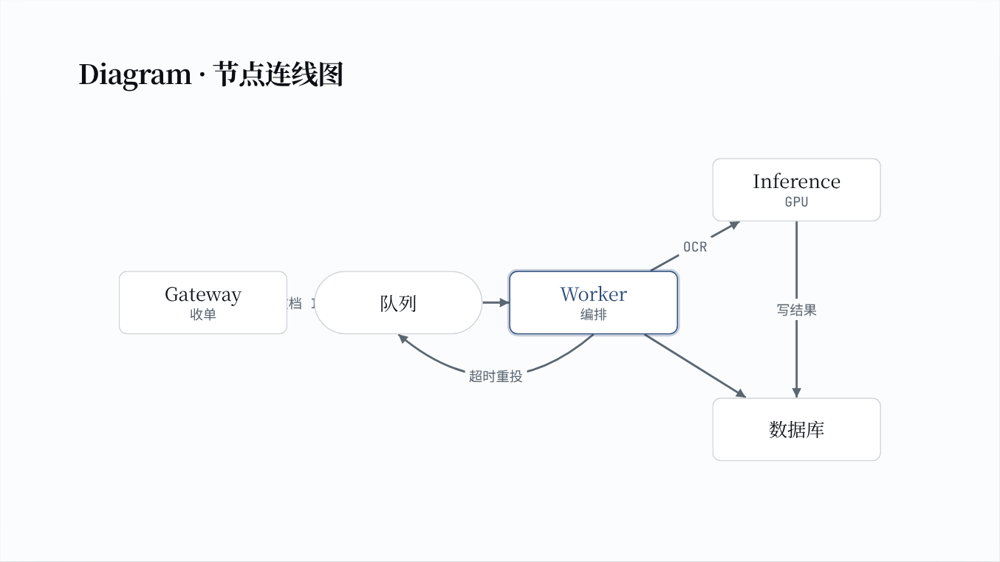

> 样张第一版少了「Inference → 数据库」这条边，5 个节点恰好构成一棵树，渲染器把它自动排成了上下分层，和给的横向坐标完全不同，边标签也挤在一起。**想按自己的坐标排，就别让连线构成纯树。**

**校验**：≤10 个节点；每条边的两端都必须是存在的节点。

---

# 讲解类

## 13. Formula

**一句话**：KaTeX 公式，逐个符号点亮，下方词表一行一行出。

**描述**：讲论文关键式子的积木，需要脚手架带 `--math`（装 KaTeX）。整式不拆开，当前讲的符号在式子里点亮、其余退后，下方词表逐行出现「符号 · 叫什么 · 管什么」；最后用 `idea`（它在说什么）和 `significance`（为什么重要）收束。

**特点**
- 逐符号讲：`tex` 里用 `[[ ]]` 圈出符号；`symbols: [{ tex, name, meaning }]`（tex 和 `[[ ]]` 里一字不差）；`active` 当前讲第几个（可数组）。
- 分部揭示（旧写法）：`parts: [{ tex, color }]` + `shown`。
- `caption` 写出处（Eq 3）。
- 同 id 跨步只换 `active`，高亮在式子里平移，式子不重排。

**适合**
- 论文的核心式子，一条式子 5~8 步：问题 → 整式 → 逐符号 → 含义 → 意义 → 代入小数字。
- `meaning` 写这个符号在这篇论文里具体是什么（形状、单位、取值范围），不写教科书定义。

**不适合**
- 项目没装 KaTeX（用 `Prose` 的 `` `等宽` `` 写式子）。
- 公式本身不是重点、只是顺带一提（强塞公式是论文解读的反模式）。
- 一步把所有符号全点亮。

**例子**（同 id 连续两步）
```json
{ "type": "Formula", "id": "mem", "role": "primary", "tex": "[[C]] = [[N]]^2 \\times [[h]] \\times [[b]]",
  "symbols": [ { "tex": "C", "name": "显存占用", "meaning": "注意力分数矩阵一共占多少字节" },
               { "tex": "N", "name": "序列长度", "meaning": "token 数，矩阵是 N × N" },
               { "tex": "h", "name": "头数", "meaning": "每个头各存一份，这里是 32" },
               { "tex": "b", "name": "每个数的字节", "meaning": "fp16 是 2 字节" } ],
  "active": 1 }
```
下一步 `"active": [2, 3]`，再加 `"idea"` 和 `"significance"`。

**UI/UE 表达要素**

| 要素 | 说明 |
|---|---|
| 视觉结构 | 整式 → 符号词表（逐行）→ 含义 / 意义两行 |
| 状态 | 当前符号点亮（式子里和词表里同步），已讲的保持，未讲的退后 |
| 动效 | 高亮平移；词表新行上浮 |
| 跨步推进 | 同 id，`active` +1 |
| 着色 | 走 CSS 类（KaTeX 不认 `var()`），不写 `\textcolor` |

**例图**

| 讲到第 2 个符号 | 讲完 + 含义与意义 |
|---|---|
| 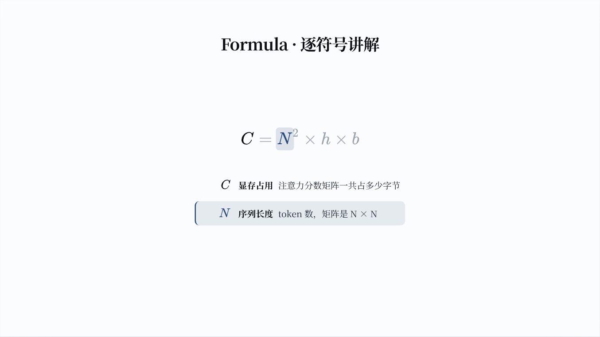 | 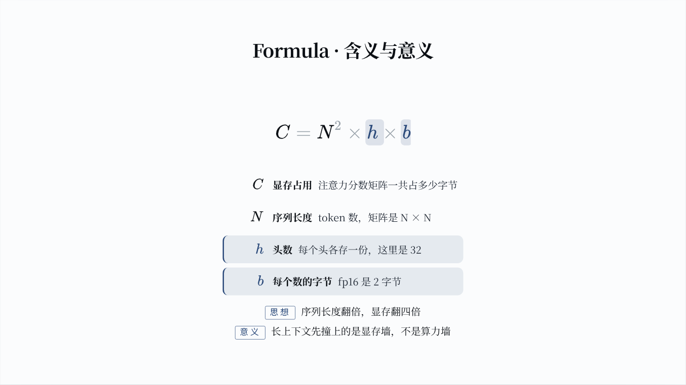 |

**校验**：要有 `tex` 或 `parts`；装了 KaTeX 时试渲染，渲染不了直接判错（常见：JSON 里反斜杠要写成 `\\`，`\middle` 必须配 `\left … \right`）。软规则：一步点亮 >3 个符号、≥3 个符号的式子只出现一步 → 建议拆步。

**常见错误**：`symbols[i].tex` 和 `[[ ]]` 里不一致（点不亮）；反斜杠转义写错。

---

## 14. CodeBlock

**一句话**：代码逐段讲 —— 当前段点亮，注释框贴在旁边，下方是变量快照。

**描述**：讲论文算法、伪代码、prompt 的积木。`notes` 把代码切成 3~5 段，每步 `active` 加一；`vars` 是「用一个小例子走一遍」时的变量值，变了的值会闪一下。

**特点**
- `code`：一个字符串（行间 `\n`）或字符串数组；≤24 行。
- `notes: [{ lines: [起, 止], title, text }]`（行号 1 起），`active` 当前讲第几条。
- `vars: [{ name, value }]`，`varsTitle`。
- `highlight`（行号数组）+ `dimOthers`：不分段时的简单高亮。
- `lang` `title` `wrap`。宽积木。规格章字号 28px。

**适合**
- 论文的 Algorithm 框、关键函数、prompt 模板。
- 输入输出讲清楚后，用小例子走一遍（vars 每步更新）。

**不适合**
- 逐字翻译代码（`text` 讲这段**为什么这么写**）。
- 超过 24 行（只留核心段，其余写成 `…`）。
- 配置文件、日志这类不需要「讲」的文本。

**例子**
```json
{ "type": "CodeBlock", "id": "route", "role": "primary", "lang": "python", "title": "混合分类（示意）",
  "code": "def route(page):\n    v = clip.embed(page)\n    votes = knn(v, k=5)\n    conf = votes.top / 5\n    if conf >= 0.7:\n        return votes.label\n    return vlm.classify(page)",
  "notes": [ { "lines": [2, 3], "title": "压成向量再投票", "text": "图像变 512 维向量，找最近 5 个邻居" },
             { "lines": [4, 6], "title": "够把握就直接放行", "text": "5 票里 4 票一致 = 0.8，过了 0.7 的线" },
             { "lines": [7, 7], "title": "拿不准才花钱", "text": "整页重新发给 VLM" } ],
  "active": 1, "vars": [ { "name": "votes.top", "value": 4 }, { "name": "conf", "value": "0.8" } ] }
```

**UI/UE 表达要素**

| 要素 | 说明 |
|---|---|
| 视觉结构 | 代码框（行号 + 代码）→ 右侧注释框（与被讲的行对齐）→ 下方变量条 |
| 状态 | 当前段行底色 + 左 accent 条；其余行退后 |
| 动效 | 注释框滑到对应行；变了的变量值闪一下 |
| 跨步推进 | 同 id，`active` +1、`vars` 换值 |

**例图**

| 讲第 1 段 | 讲第 2 段 + 变量快照 |
|---|---|
| 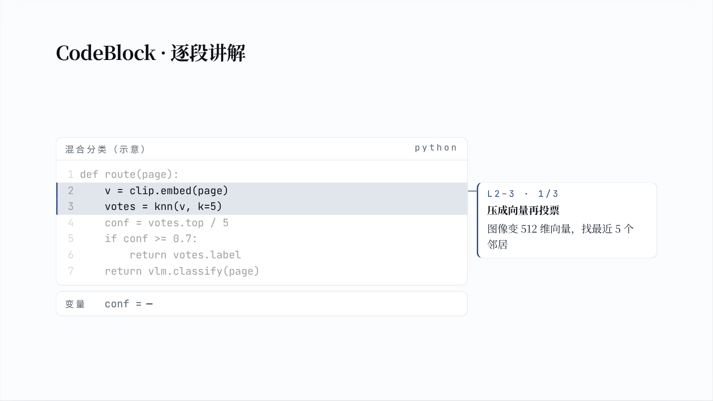 | 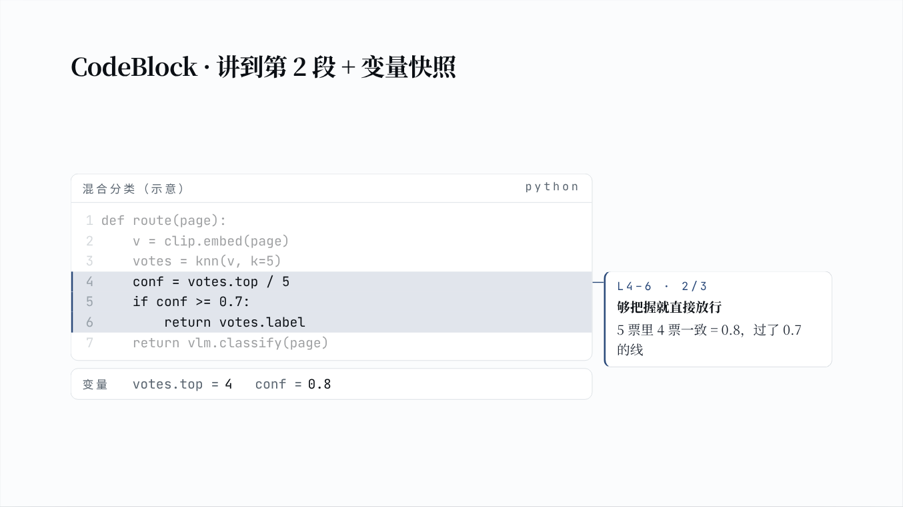 |

**校验**：`notes` 行号在代码范围内、`active` 在范围内、代码 ≤24 行。自动修正：`code` 是数组时每项转字符串；`highlight` 单值转数组；`notes.lines` 单个数转 `[n, n]`；`active` 越界夹回。

**常见错误**：代码里用双引号没转义（JSON 炸）；注释写成逐行翻译。

---

## 15. Figure

**一句话**：论文原图上屏 —— 聚光到一个区域、推镜放大，或者只裁出一块。

**描述**：定性材料（架构图、热图、样例输出）只能用原图，不能自己重画。`regions` 在原图上定义几个区域（百分比坐标），`active` 指当前讲哪一块；同 id 连续几步只换 `active`，聚光圈 / 镜头在区域之间滑动，像一个连续的镜头而不是幻灯片。

**特点**
- 必填：`src`（只能是材料里列出的 `/paper/...` 路径）、`label`（"Fig 2"）、`alt`（图里画了什么）。
- `regions: { id: { x, y, w, h, label } }`（原图百分比 0~100，label ≤24 字）。**图上不放任何文字**：label 显示在图框下方的图例里；多个区域时编号放在图框外的边距里（区域左右分布放上边、上下分布放左边），对齐各自的框。区域框比给定坐标往外扩 4px，框线不压边缘的字。
- `active`：区域 id，可多个；`null` = 整图。
- `mode`：`spotlight`（默认，其余淡出）/ `zoom`（推镜放大）/ `crop`（只剩这一块）；`minimap`（zoom / crop 时角落的位置小地图）；`numbered`（多个 active 时标 1 2 3）。
- `credit` `variant`（original / redraw / animated）`height` `intent`。
- 旧写法 `focus: { x, y, w }`。

**适合**
- 论文的招牌图、架构图、所有定性材料。
- 一张密集的大图，口播「看左边这块」时把视线引过去。

**不适合**
- 拿不到原图（用 `Placeholder`，不要找无关图凑，不要编路径）。
- 想表达的是数量关系（重画成 `BarChart`，标 `variant: "redraw"`）。
- 一步把所有区域全点亮（等于没指）。

**例子**（同 id 连续两步）
```json
{ "type": "Figure", "id": "f2", "role": "primary", "src": "/paper/fig-02.png", "label": "Fig 2",
  "alt": "T2T 与 C2C 两种通信方式的对照",
  "regions": { "t2t": { "x": 40, "y": 0, "w": 38, "h": 50, "label": "T2T：传文字" },
               "c2c": { "x": 40, "y": 50, "w": 38, "h": 50, "label": "C2C：传 cache" } },
  "active": "t2t", "mode": "spotlight", "intent": "传文字时，接收方不知道 <p> 是什么" }
```
下一步 `"active": "c2c", "mode": "zoom", "minimap": "br"`。

**UI/UE 表达要素**

| 要素 | 说明 |
|---|---|
| 视觉结构 | 原图框 → 区域圈 + 标签 → 出处行（Fig N · 论文原图）→ 作者意图条（**在图的下方**，整宽） |
| 状态 | 区域：当前（圈 + 标签）/ 其余（淡出）；mode 三种 |
| 动效 | 圈 / 洞 / 镜头在区域间平滑移动（CSS transition） |
| 跨步推进 | 同 id 只换 `active` —— **构图也要保持一致**，否则整屏重挂，镜头不滑 |
| 诚实性 | 不改原图，出处始终是论文 |

**例图**

| 聚光：T2T 那一块 | 推镜：放大到 C2C 那一块 |
|---|---|
| 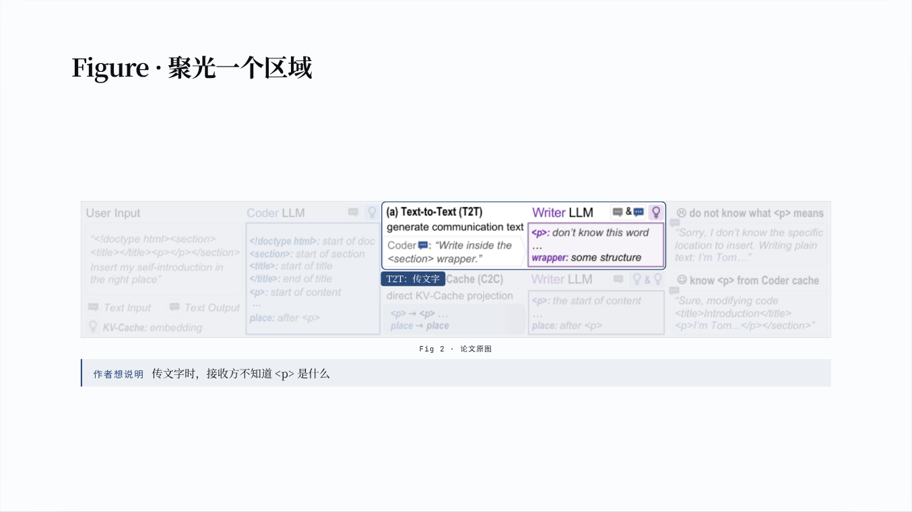 | 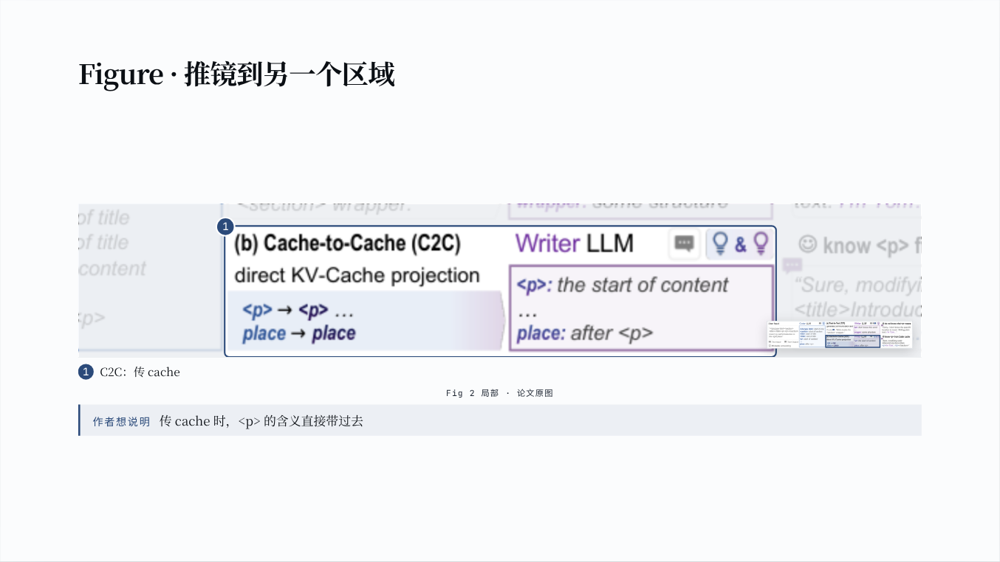 |

> 很扁的图（宽高比 5:1 以上）在整屏里会显得小，聚光模式下字看不清；这类图优先用 `zoom` / `crop` 讲局部。

**校验**：`src` 不在可用原图清单里 → 自动换成 Placeholder；regions 坐标是 0~100；`active` 指向存在的区域；`mode` 合法；区域 label ≤24 字。自动修正：`regions` 写成数组 → 转对象；`active` 写成下标 → 转 id；`focus` 数组 → 对象。软规则：≥3 个区域一步全点亮 → 建议拆步。

---

# 动画类

这三个积木来自一组 GPU 讲解动画的提炼（[`MOTION-BLUEPRINTS.md`](MOTION-BLUEPRINTS.md) §0 通用约束 + 蓝图 11~13）。共同点：**同一个对象从头用到底，跨步只改一个量**；动画在一步内跑完并定格，不循环；颜色只用 accent 的深浅。

## 16. Grid

**一句话**：同一张网格从头用到底，跨步只扩大点亮范围 —— 讲「小单元组成大单元」的层级。

**描述**：thread → warp → block → grid、字 → 词 → 句、样本 → batch → epoch。网格按「组 → 行 → 列」排好，`lit` 是按阅读顺序点亮的格数；每步把 `lit` 调大到上一级，新点亮的格按顺序一格格填上；上一级用 `done`（更淡的同色）留着。标签写成「数量 = 名字」。

**特点**
- `groups`（几组）、`groupCols`（组排几列）、`rows` × `cols`（每组几行几列）。
- `lit`：点亮几格；`done`：之前讲过的范围（通常写上一步的 `lit`）。
- `label`（当前状态的名字，换的时候淡入）、`sub`。
- 总格数 ≤4096 —— 不用真实规模，标签里写真实数字。
- 宽积木。高度上限 460px，按比例缩放。

**适合**
- 有明确倍数关系的层级（32 个 = 1 warp，8 个 warp = 1 block）。
- 「5 个 pod × 5 个任务 = 25 个并发槽」→ 扩到 100 个槽的规模感。
- 「1000 页里 40 页转人工」这种比例的直观呈现（点亮一部分）。

**不适合**
- 层级只有三四级、每级是有名字的模块（用 `Chips` / `Diagram`）。
- 没有包含关系的并列数量（用 `Stats` / `BarChart`）。
- 需要精确读数的场合（格子是规模感，不是刻度）。

**例子**（同 id 连续几步）
```json
{ "type": "Grid", "id": "thr", "role": "primary", "groups": 8, "groupCols": 4, "rows": 8, "cols": 32,
  "lit": 32, "done": 1, "label": "32 个线程 = 1 个 warp" }
```
后续步：`"lit": 256, "done": 32, "label": "8 个 warp = 1 个 block"` → `"lit": 2048, "done": 256, "label": "8 个 block = 1 个 grid"`。

**UI/UE 表达要素**

| 要素 | 说明 |
|---|---|
| 视觉结构 | SVG 网格（组间留大间距）+ 下方标签 + sub |
| 状态 | idle（极浅）/ done（accent 中等深）/ lit（accent） |
| 动效 | 只有**新点亮**的格按阅读顺序逐格填上（总时长 ≤1.4 秒）；标签换文字时淡入 |
| 跨步推进 | 同 id 改 `lit` / `done` / `label` |
| 控制变量 | 网格本身从不换，只改高亮范围 —— 观众看得出「上一级是这一级的一部分」 |

**例图**

| 动画进行中（450ms） | 定格：1 个 warp | 扩到整张网格 |
|---|---|---|
| 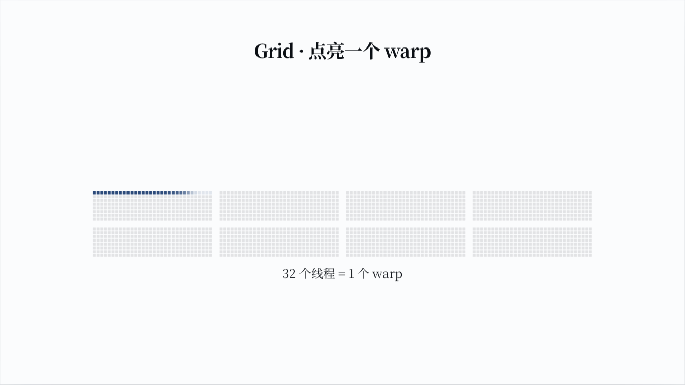 | 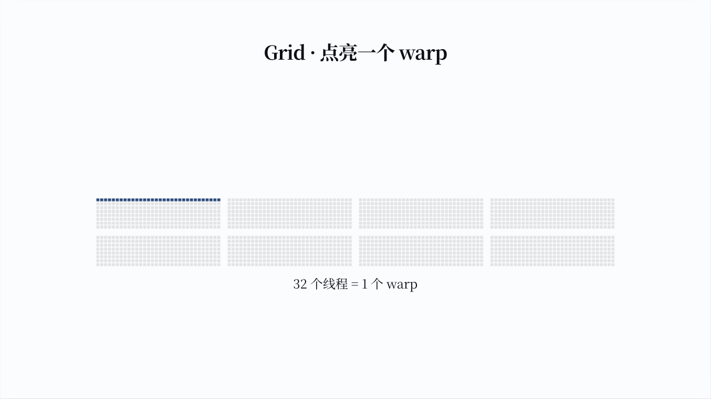 | 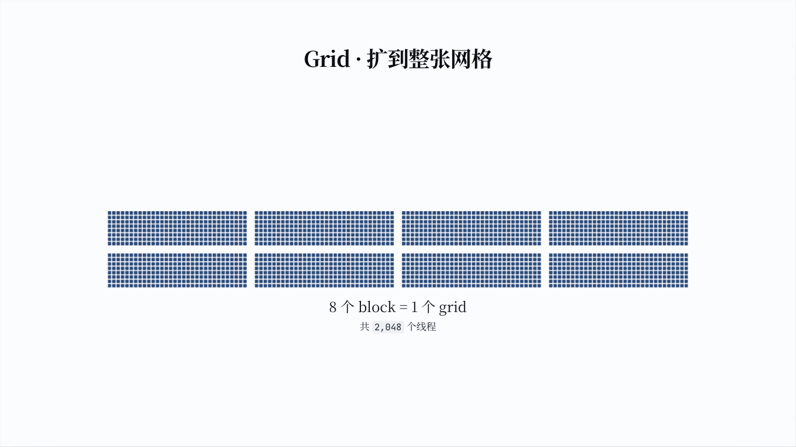 |

**校验**：数值字段必须是数字（字符串自动转）；总格数 ≤4096；`lit` 在 0..总格数（越界自动夹回）。

**手写章节**：`<Grid cols lit rows groups groupCols done label sub width height />`。

---

## 17. Flow

**一句话**：数据包沿等长轨道一趟一趟跑，每趟留一道刻度并计数 —— 把「搬了几次」做成能数的事件。

**描述**：访存次数、网络往返、重算、跨服务调用，都是「看不见的代价」。Flow 把每一趟画成一个带标签的包从一端跑到另一端，回程用描边样式；所有轨道共用一个时钟（第 k 趟同时出发），趟数少的那条先跑完，差了几趟一眼看得见。也能演「延迟 vs 带宽」：两条轨道趟数一样、速度一样，只有包的宽度不同。

**特点**
- `lanes`：1~4 条，每条 `{ from, to, label, trips, width, count, dim }`。
- `trips`：每项一趟。字符串 = 包上的标签（from → to）；`{ "label": "t", "back": true }` = 回程；空字符串 = 不带标签的小方块。
- `width`：1~4，包有多宽（带宽）。
- `count`：跑完后的计数文字，默认「N 趟」。
- `tripMs`：每趟时长；默认按最多趟数把整步压在约 3.6 秒内（单趟 450~900ms）。
- 所有轨道共用一套列宽（subgrid）：**轨道等长 + 时长相同 = 速度相同**，计数文字长短不影响。
- 同 id 跨步加长 `trips`，只有新加的趟会跑。

**适合**
- 「两个 kernel 跑 5 趟显存，融合后 3 趟」。
- 「OCR 每页跑一次、8 页 8 次，LLM 全文只跑 1 次」。
- 「超时 30 秒被重新派出去，同一份文档跑两遍」（2 趟 vs 1 趟）。
- 延迟 vs 带宽、窄管道 vs 宽管道。

**不适合**
- 讲的是耗时长短而不是次数（用 `BarChart`）。
- 一条轨道超过 10 趟（拆步，同 id 逐步加长）。
- 这一拍口播不到 5 秒（动画跑不完就被切走）。
- 复杂拓扑（多个节点之间来回）—— 用 `Diagram`。

**例子**
```json
{ "type": "Flow", "role": "primary", "lanes": [
  { "from": "显存", "to": "片上", "label": "两个 kernel：`t = a + b`，`y = relu(t)`",
    "trips": ["a", "b", { "label": "t", "back": true }, "t", { "label": "y", "back": true }] },
  { "from": "显存", "to": "片上", "label": "融合成一个：`y = relu(a + b)`",
    "trips": ["a", "b", { "label": "y", "back": true }], "count": "3 趟 · 少 40%" } ] }
```

**UI/UE 表达要素**

| 要素 | 说明 |
|---|---|
| 视觉结构 | 每条轨道：起点块（浅）→ 轨道（上下细线）→ 终点块（深）→ 刻度 + 计数；轨道下一行说明 |
| 状态 | 去程包实心 accent；回程包描边；`dim` 轨道半透明 |
| 动效 | 包用 `left` 沿轨道移动（不碰 transform）；每趟结束留一道刻度；全部跑完出计数；**最后一趟的包停在终点** |
| 跨步推进 | 同 id 加长 `trips` |
| 控制变量 | 轨道等长、时钟统一 —— 差别只在趟数或宽度 |
| 时长 | 一步内 ≤约 3.6 秒跑完，之后定格 |

**例图**

| 动画进行中（两条轨道同时在跑第 3 趟） | 定格：5 趟 vs 3 趟 | 延迟 vs 带宽 |
|---|---|---|
| 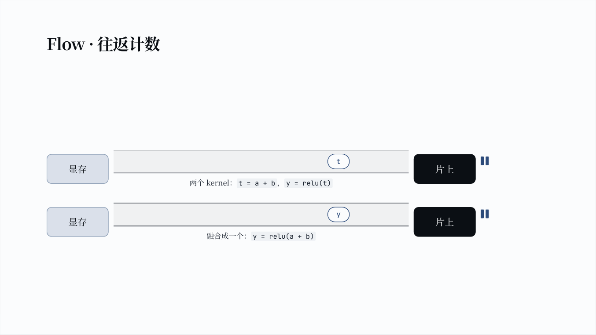 | 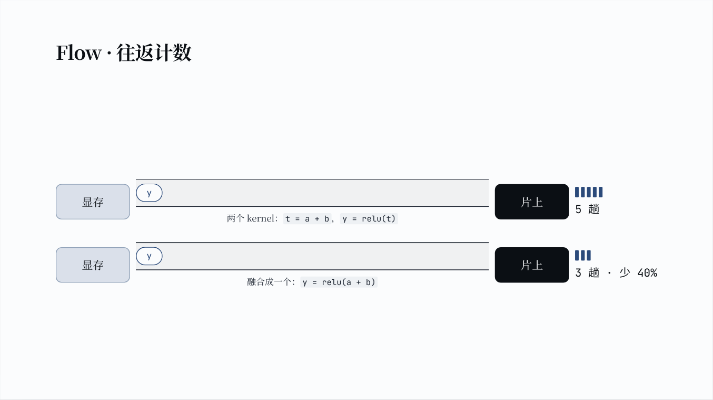 | 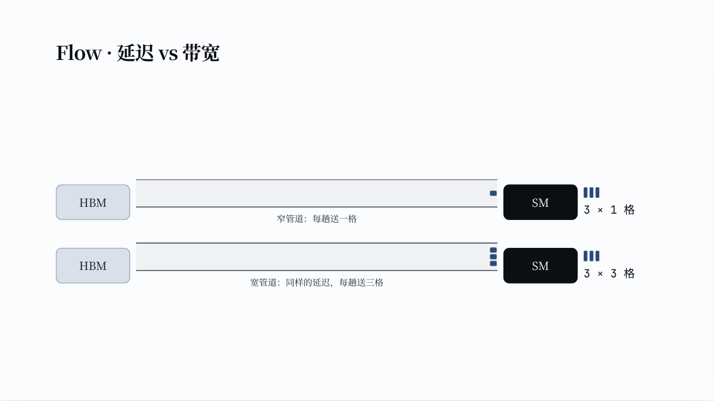 |

**校验**：1~4 条轨道；每条要有 `from` / `to`；每条 ≤10 趟；`width` 只能 1~4。自动修正：`lanes` 单值转数组；`trips` 写成数字 → 转成 N 个无标签小方块；`trips` 单个字符串转数组。

**手写章节**：`<Flow lanes={[{ from, to, label, width, trips: [{ label, back }], count, dim }]} tripMs />`（trips 每项要写成对象）。

---

## 18. Gauge

**一句话**：一个输入一档档变大，另一个量按真实比例跟着涨，旁边是一个有上限的容器。

**描述**：序列长度撑爆显存、batch 拉高延迟、副本数逼近 GPU 上限。左边的正方形**边长 ∝ input.value / input.max**，所以面积 ∝ value² —— 平方增长看得见，不会被压成线性；中间写换算因子；右边空心容器按 `value / capacity` 填充，超过上限填满并标「超出上限」。同 id 连续几步只改数值，尺寸平滑过渡。

**特点**
- `value`（读数）、`capacity`（上限）、`unit`、`label`（容器叫什么）、`decimals`。
- `input: { value, max, label, caption, shape }`：`shape: "square"`（默认，面积 ∝ 平方）或 `"bar"`（横条，线性量）。
- `factors`：换算因子（「× 32 头 × 2 B」），让屏幕上的派生数字能验算。
- `size`：正方形框和容器的高度（默认 380px，同屏 ≥3 块时 240px）。
- 容器列定宽 260px：读数从「0.06 GB」变到「144 GB · 超出上限」时，左边的正方形不会晃。
- 同 id 序列的 `input.max` / `capacity` 自动统一。

**适合**
- 有物理上限的扫参：显存、带宽、配额、预算。
- 非线性增长（平方、指数）要让人「看出来」的场合。
- 验算拍：配一张 Callout 写出算式。

**不适合**
- 没有上限、只是比几组数（用 `BarChart`）。
- 单个静态数字（用 `BigNumber`）。
- 输入和读数之间没有明确的换算关系（因子写不出来就别用）。

**例子**（同 id 连续几步）
```json
{ "type": "Gauge", "id": "attn", "role": "primary",
  "input": { "value": 9216, "max": 49152, "label": "N = `9,216`", "caption": "一个头：N × N" },
  "factors": "× 32 头 × 2 B", "value": 5.1, "capacity": 80, "unit": "GB", "label": "HBM" }
```
后续步只改 `input.value` 和 `value`：32768 → 64；49152 → 144（超出上限）。

**UI/UE 表达要素**

| 要素 | 说明 |
|---|---|
| 视觉结构 | 左：caption + 正方形（虚线框表示 max）+ 输入标签；中：换算因子；右：容量标题 + 空心容器 + 读数 |
| 状态 | 正常 / 超出上限（容器 accent 描边 + 外环 + 「超出上限」） |
| 动效 | 首次入场从 0 长到目标；之后跨步用 transition 平滑过渡；读数换值时淡入 |
| 跨步推进 | 同 id 改 `input.value` / `value` |
| 诚实性 | 边长按真实比例；同一序列 max / capacity 一致 |

**例图**

| N = 9,216：5.1 GB | 下一步 N = 49,152：超出 80 GB 上限 |
|---|---|
|  |  |

**校验**：`value` / `capacity` 是数字且 capacity > 0；`input` 要写成 `{ value, max(>0), label }`。自动修正：数值写成字符串（含千分位逗号）→ 转数字；同 id 序列统一 `capacity` / `input.max`。

**手写章节**：`<Gauge value capacity unit label input factors decimals size />`。

---

# 兜底

## 19. Placeholder

**一句话**：缺素材时的占位卡 —— 宁可承认缺，也不编图、不编数据。

**描述**：原图拿不到、数据论文没给的时候用它。按真实比例留出位置，写清楚缺的是什么、为什么缺、之后怎么补。

**特点**
- `label`（缺的是什么）、`note`（原因 / 补救）、`width`、`ratio`（宽高比）。
- `Figure` 的 `src` 不在原图清单里时，`normalizeSpec` 会自动换成 Placeholder。
- 积木渲染出错时，错误边界也用它显示「积木渲染失败 · 类型」，坏一块不会让整屏白掉。

**适合**
- arXiv 只有 PDF、图还没渲染出来；论文没公开的数字。

**不适合**
- 拿得到原图却懒得抓（先按 PAPER-INTERPRETATION §6.5 抓）。
- 当装饰。

**例子**
```json
{ "type": "Placeholder", "role": "primary", "label": "Fig 5 原图未取得", "note": "arXiv 只有 PDF，整页渲染后再补", "width": 900, "ratio": 2.2 }
```

**UI/UE 表达要素**

| 要素 | 说明 |
|---|---|
| 视觉结构 | 按比例的空框 + 小号大写标签 + 一行说明 |
| 状态 / 动效 | 无，淡入 |
| 诚实性 | 不放任何「看起来像」的假内容 |

**例图**


---

## 常见组合

| 组合 | 构图 | 用在 |
|---|---|---|
| `BigNumber` + `Callout` | rule-of-thirds | 验算拍：数字说话，卡片解释 |
| `BarChart` + `Callout`（看哪里） | asymmetric-60-40 | 结果对比 + 指出重点 |
| `Figure`（regions）+ `Callout` | asymmetric-60-40 | 讲原图的一块 + 这块说明什么 |
| `Formula` 连续 5~8 步 | centered-hero（stable） | 一条关键式子讲透 |
| `CodeBlock` 连续 3~5 步 | full-width-strip（stable） | 算法逐段 + 小例子走一遍 |
| `RevealList` + `Callout` | asymmetric-60-40 | 要点逐项 + 旁注 |
| `Gauge` + `Callout`（算一下） | asymmetric-60-40 | 扫参 + 写出算式 |
| `Grid` 连续 3~4 步 | centered-hero（stable） | 层级逐级扩圈 |
| `Flow` + `annotation` Prose | diagram-canvas | 往返计数 + 一行定义 |
| 两块 `BigNumber` | split-screen | 修复前 / 修复后 |
| `Diagram` + `Prose` | diagram-canvas | 架构 + 一句话总结 |

规则提醒：同构图连续 ≤2 步（stable 序列除外）；一章 ≥3 种构图；整章至少两处「跨步推进」的序列；整章纯 Prose / Callout / Quote 判不合格。

---

## 已知限制

1. **模型不主动用新积木**（2026-10-05 实测）：2605.18818v1 第 2 版 93 步里 Grid / Flow / Gauge 一次都没出现，「OCR 跑 8 次 vs LLM 跑 1 次」被画成 Compare，「25 个并发槽翻倍」被画成 BarChart。规则书只有抽象分类，模型认不出场景。待做：规则书加口播句式的识别信号 + spec-check 软规则提示。
2. **动画预算闸看不到积木内部的时长**：`anim:budget` 只扫章节 CSS。Flow 一步最多约 3.6 秒、Grid 填充 ≤1.4 秒、BigNumber 计数用 `--dur-cinematic`，目前靠规则书写「这一拍口播至少 5 秒」，没有机器检查。
3. **BarChart 跨步是跳变**：同 id 换数值时柱高直接跳到新值（入场动画的 fill-mode 会压住 transition），纵轴已锁定所以比例是对的，只是没有平滑过渡。要平滑的扫参用 `Gauge`。
4. **Diagram 的自动分层会覆盖坐标**：≥5 个节点、连线构成树、≥3 层时按层重排（见 Diagram 例图说明）。
5. **扁长原图显得小**：宽高比 5:1 以上的图整屏放显得很小，讲局部用 `zoom` / `crop`。
6. **Formula 依赖 KaTeX**：脚手架没带 `--math` 时不能用；App.tsx 必须引入 `styles/math.css`，否则上标下标会平排（「N²」显示成「N2」）。
7. **BigNumber 只数整数部分**：`countUp` 时小数部分直接显示，不跳。
8. **没有「嵌入空间点云」积木**：CLIP / KNN 这类「向量挨得近就是一类」的几何直觉，目前只能用 Diagram 近似。
9. **所有动画不随暂停停止**：Auto 模式暂停只停音频；入场动画和 Flow / Grid 的过程动画会继续跑完（都在几秒内定格，不影响读图）。

---

## 例图怎么重新生成

例图由两份脚本生成，放在 [`block-catalog/`](block-catalog/) 下：

- `make-samples.py`：生成 27 步样张章的 `spec.json` 和 `narrations.ts`（每个积木 1~3 步），以及步序表 `keys.json`。
- `shoot.mjs`：起 `vite preview`，跳到样张章，逐步截 `.stage-fitter`；`MID` 里列的步额外在动画进行中截一张（文件名 `-mid.png`）。

步骤（在任意一个带 `node_modules` + playwright 的演示工程里，`--math` 脚手架）：

```bash
# 1. 用样张替换某一章（例：注册表第 2 章 01-coldopen），清空它的 evidence.ts
python3 references/block-catalog/make-samples.py <项目>/src/chapters/01-coldopen
# 2. 跑一遍 normalizeSpec + spec-check，构建（本地 QA 用 base=/）
node scripts/spec-check.mjs src/chapters/01-coldopen
PUBLIC_BASE=/ npx vite build
# 3. 截图（脚本按键「2」跳到第 2 章；样张放在别的章就改这里）
cp references/block-catalog/shoot.mjs . && node shoot.mjs references/block-catalog
```

改了积木样式之后重截一遍，用拼图看一轮（见 `VISUAL-QA.md` 的 contact sheet 做法）再替换。
